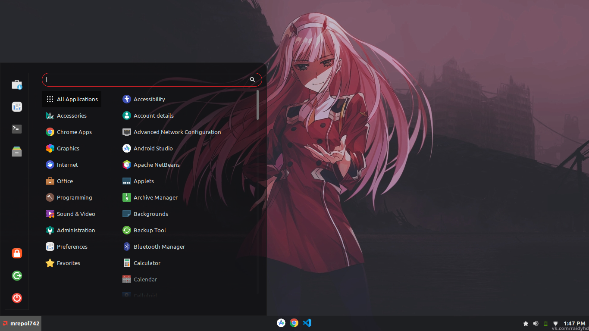

# Mint-Dark-Red
Transprency, Modern, Darked, Red all new theme for Mint.

## Screenshots

## How to install
- Open the /home/(username)/.themes in Files
- Right Click Open in Terminal
- git clone https://github.com/mrepol742/Mint-Dark-Red
- Then open Themes
- Select Applications & Desktop to Mint-Dark-Red
